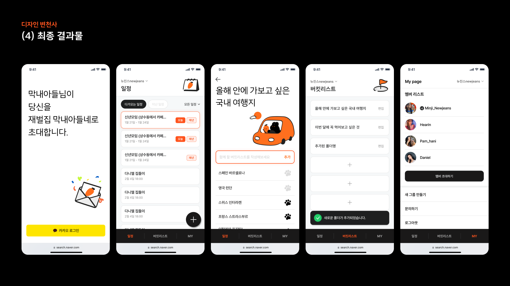
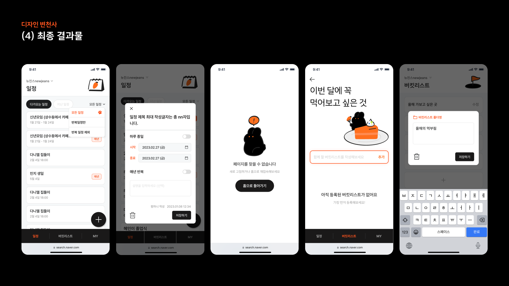

# Ditto

<div align="center">


<br/>
<b>그룹 일정 &amp; 버킷리스트 서비스</b>

</div>

## 🐰 About this project

Ditto는 그룹 내에서 일정과 버킷리스트를 관리할 수 있는 웹 서비스입니다. 사용자들은 그룹을 생성하거나 참여하여 서로의 일정 및 버킷리스트를 공유하고 관리할 수 있습니다.

## 🔗 Demo

Link: https://ditto-o.vercel.app/

아래는 예시 페이지 입니다.




## 🔨 Tech stack

Next.js와 Edge function을 사용해 풀스택으로 개발했습니다.

- Next.js + Edge functions
- Supabase
- React-query
- Yarn classic
- TypeScript
- Chakra-ui (emotion-js)
- Zustand

## ✨ Features

MVP에서 다음과 같은 기능을 완성했습니다.

- ✅ 카카오 로그인 기반 회원가입
- ✅ 그룹 생성 및 참여
- ✅ 그룹 내 일정 추가 및 편집
- ✅ 그룹 내 버킷리스트 추가 및 편집

다음 목표로 생각하는 기능은 다음과 같습니다.

- 그룹 탈퇴
- 그룹 삭제
- 새로운 일정 및 버킷리스트 생성 알림

## 🏃 Getting started

> 💡 .env.local 파일이 필요합니다.
> 해당 파일은 별도의 notion에서 공유되고 있습니다.

```
yarn install
yarn run dev
```

## 🏠 Team Member

<table align="center">
  <thead>
    <tr>
      <th align="center">UI/UX Designer</th>
      <th align="center">UI/UX Designer</th>
      <th align="center">(PM) Frontend Developer</th>
      <th align="center">Frontend Developer</th>
      <th align="center">Frontend Developer</th>
    </tr>
  </thead>
  <tbody>
    <tr>
      <td align="center">
        <a href="https://www.linkedin.com/in/%ED%98%84%ED%9D%AC-%EC%9D%B4-b42316235/">
          
          <br />
          이현희
        </a>
      </td>
      <td align="center">
        <a href="https://www.linkedin.com/in/uxjiwonchoi/">
          
          <br />
          최지원
        </a>
      </td>
      <td align="center">
        <a href="https://github.com/young-do">
          
          <br />
          조영도
        </a>
      </td>
      <td align="center">
        <a href="https://github.com/siyeons">
          
          <br />
          이시연
        </a>
      </td>
      <td align="center">
        <a href="https://github.com/sangbooom">
          
          <br />
          박상범
        </a>
      </td>
    </tr>
  </tbody>
</table>

## 👏 Special thanks to

Ditto라는 평범한 단어가 멋진 이름이 될 수 있었던 것은 모두 뉴진스 님들 덕분입니다. 뉴진스 최공 🥰

[](https://youtu.be/Km71Rr9K-Bw)
